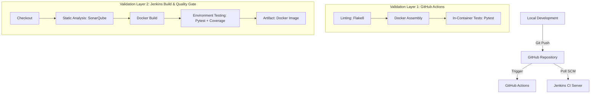

# ACEest Fitness & Gym DevOps Project

This repository contains the complete DevOps CI/CD pipeline assignment for **ACEest Fitness & Gym**. The project demonstrates a production-grade automated deployment workflow, transitioning a Flask application from local development through containerization and multi-layered validation.

## High-Level Architecture



## Project Components

- **Source Code**: A modular Flask application (`app.py`) managing fitness programs with a premium web interface.
- **UI & Templates**: 
  - `templates/base.html`: Core design system using Glassmorphism and CSS variables.
  - `templates/index.html`: Interactive landing page with dynamic program cards.
  - `templates/client_detail.html`: Specialized detail view for individual fitness protocols.
- **Unit Testing Framework**: Comprehensive Pytest suite (`tests/`) ensuring logic integrity.
- **Infrastructure as Code**:
  - `Dockerfile`: Highly optimized image for consistent environment execution.
  - `main.yml`: Automated GitHub Actions pipeline for immediate feedback.
- **Jenkins Pipeline**: Orchestrates the primary "Build & Quality Gate" phase, integrating SonarQube for static code analysis.

## UI & Design System

The application now features a **premium "Glassmorphism" UI** designed for a modern user experience:
- **Dark Mode Aesthetic**: Sleek dark backgrounds with vibrant accent gradients.
- **Responsive Layout**: Designed to work across different screen sizes.
- **Interactive Components**: Dynamic hover effects and intuitive navigation between program listings and detailed views.

## Local Setup & Execution

### 1) Virtual Environment Setup
**macOS / Linux:**
```bash
python -m venv .venv
source .venv/bin/activate
```
**Windows (PowerShell):**
```powershell
python -m venv .venv
.venv\Scripts\Activate.ps1
```

### 2) Installation & Execution
```bash
python -m pip install --upgrade pip
pip install -r requirements.txt
python app.py
```
The application will be accessible at: `http://localhost:5000`

## Testing & Validation

### Manual Execution
To run the full suite of unit tests locally:
```bash
pytest tests/
```

### Containerized Testing
To verify the application behavior within its production environment:
```bash
docker build -t aceest-fitness:latest .
docker run --rm aceest-fitness:latest python -m pytest tests/
```

## CI/CD Integration Logic

### GitHub Actions (Validation Layer 1)
Triggered on every `push` and `pull_request` to the `main` branch. It ensures that no code is merged without passing syntax linting (`flake8`) and unit tests within the target Docker environment.

### Jenkins Pipeline (Build & Quality Gate)
Configured to poll the repository for changes. It executes a rigorous lifecycle:
1. **SonarQube Scan**: Analyzes code quality and security vulnerabilities using `sonar-project.properties`.
2. **Environment Simulation**: Builds the Docker image and executes tests with code coverage reporting.
3. **Artifact Generation**: Saves the validated Docker image for deployment.
